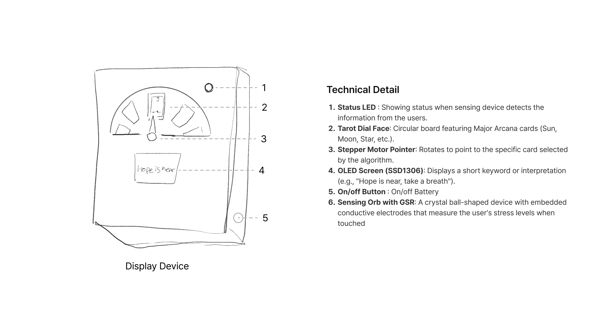
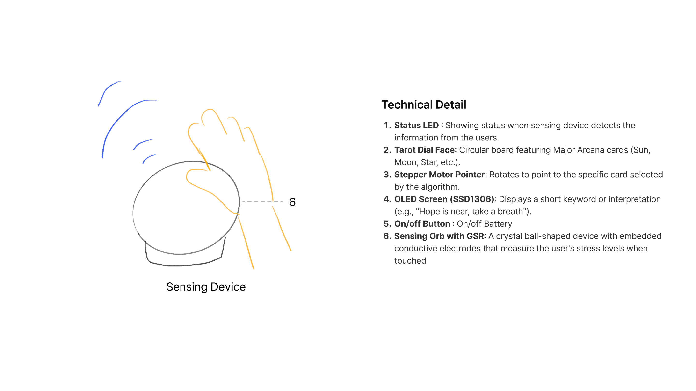

# The Inner Oracle: Biometric Fortune Teller

## 1. Project Overview
**The Inner Oracle** is an interactive fortune-telling machine that combines biometric data with Tarot symbolism. Instead of relying on pure chance, it measures the user's physiological state (skin conductance) to generate a personalized reading. By placing a hand on the sensing orb, the user triggers a mechanical dial that points to a Tarot card, while an OLED screen displays a cryptic message tailored to their inner condition.

 

## 2. Display Device
The output consists of a dual-display system: a physical mechanical dial and a digital screen.

* **Components:**
    * **Stepper Motor:** 28BYJ-48 with ULN2003 Driver (Part #105990072) - *Controls the Pointer (Label #3)*
    * **OLED Display:** 0.96" I2C OLED (Generic SSD1306) - *Shows the text (Label #4)*
    * **Tarot Dial Face:** Custom circular board (Label #2)
* **Functionality:** The stepper motor rotates the pointer to a specific Tarot card based on the sensor input, while the OLED explains the meaning.

## 3. Sensing Device
The input mechanism simulates a "crystal ball" reading using Galvanic Skin Response (GSR).

* **Component:** Grove - GSR Sensor (Seeed Studio, Part #101020052)
* **Functionality:** This sensor measures the electrical conductance of the skin.
* **Operation (See Label #6 in Sketch):** When the user places their hand on the electrodes embedded in the sensing orb, the ESP32C3 reads the analog signal to detect stress levels.

## 4. System Architecture & Data Flow
The device operates on a closed-loop system where biometric input directly drives physical and digital outputs.

### Data Flow Diagram
`[User Hand] --> [GSR Sensor] --(Analog Signal)--> [XIAO ESP32C3] --(I2C/GPIO)--> [OLED & Motor]`

*(Note: Don't forget! You need to draw a simple box diagram (boxes and arrows) separately and upload it here. The sketch doesn't cover this part.)*
