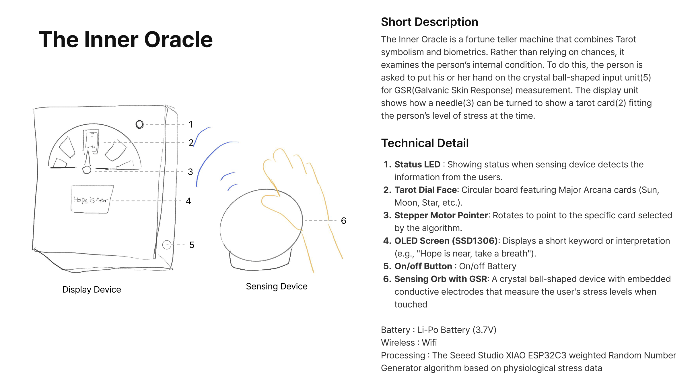

# 🔮 InnerOracle: Biometric Fortune Teller

## 1. Project Overview
**InnerOracle** is an interactive, tangible interface that translates physiological stress into mystical guidance. Unlike traditional fortune-telling machines that rely on random chance, InnerOracle utilizes **Galvanic Skin Response (GSR)** to measure the user's emotional arousal and provides a personalized Tarot reading through a mechanical dial and an OLED display.

 

## 2. Technical Complexity & System Architecture
The system is built with a **Dual-Node Architecture** using two Seeed Studio XIAO ESP32-C3 microcontrollers communicating via the **ESP-NOW** wireless protocol.

### [Sensing Node]
* **Microcontroller**: Seeed Studio XIAO ESP32-C3
* **Sensor**: Grove GSR Sensor with custom Copper Tape Electrodes
* **Logic**: Implements an **Adaptive Baseline Tracking** algorithm to detect emotional triggers beyond skin resistance fluctuations.
* **Feedback**: Provides immediate visual feedback via NeoPixel LED (Rainbow effect).

### [Display Node]
* **Microcontroller**: Seeed Studio XIAO ESP32-C3
* **Actuator**: **X27.168 Stepper Motor** (Precision Gauge Motor)
* **Display**: 0.96" I2C SSD1306 OLED
* **Logic**: Receives real-time stress data and controls the physical needle with custom homing and calibration sequences.

## 3. Data Flow
`[User's Hand] -> [GSR Sensor] -> [Sensing XIAO] --(ESP-NOW Wireless)--> [Display XIAO] -> [X27 Motor & OLED]`

## 4. Hardware Fabrication
* **Custom PCB**: Designed and soldered at GIX Prototyping Labs.
* **Enclosure**: 2-part 3D printed housing ("The Orb" and "The Dial Box").
* **Power**: Powered by 3.7V 1000mAh LiPo batteries, optimized for up to 150+ hours of typical usage.

## 5. Repository Structure
* `/Sensing_Node`: Source code for GSR data processing and ESP-NOW transmission.
* `/Display_Node`: Source code for motor control, OLED UI, and data reception.

## 6. Budget Summary
* Total Project Cost: **$66.95**
* Key Components: GSR Sensor ($32.99), 1000mAh Batteries ($16.98), XIAO ESP32C3 ($10.99).
